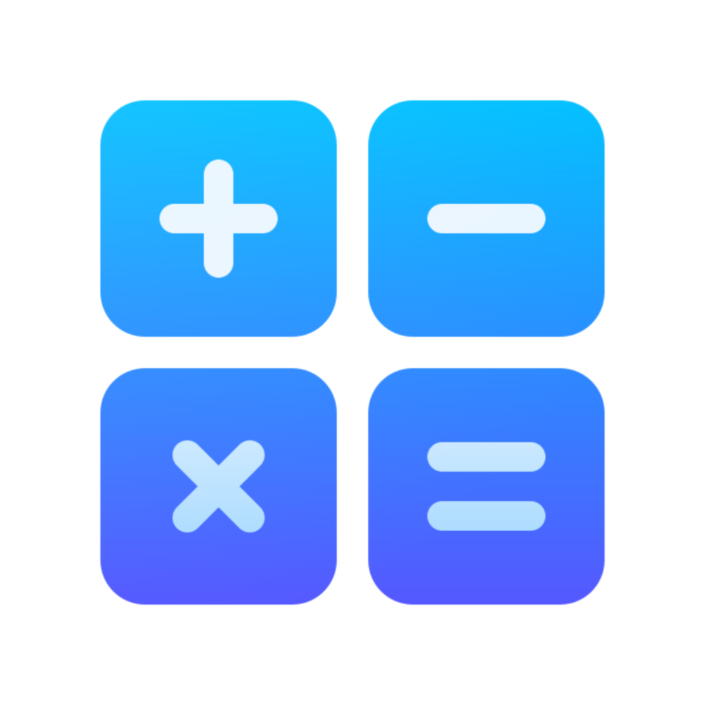
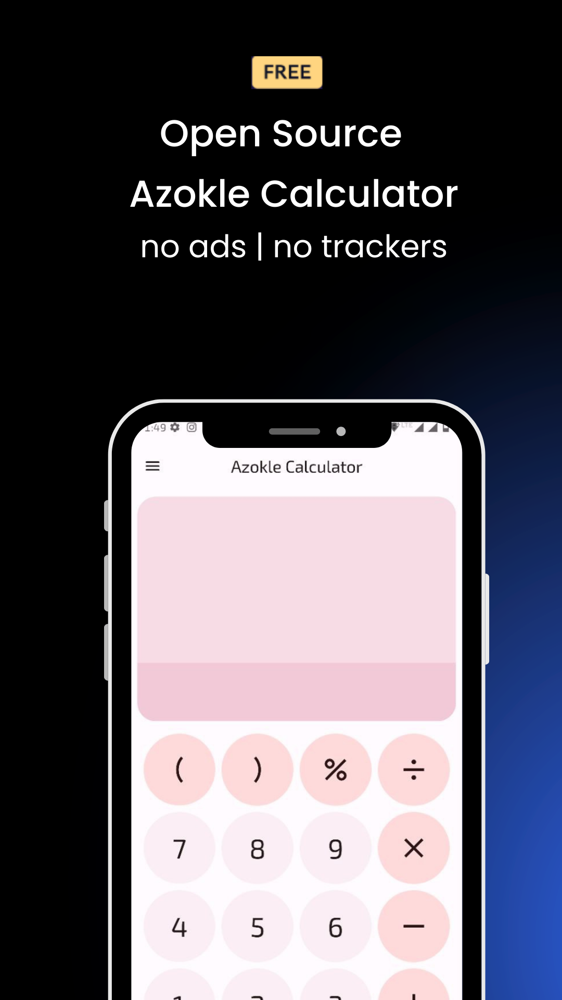
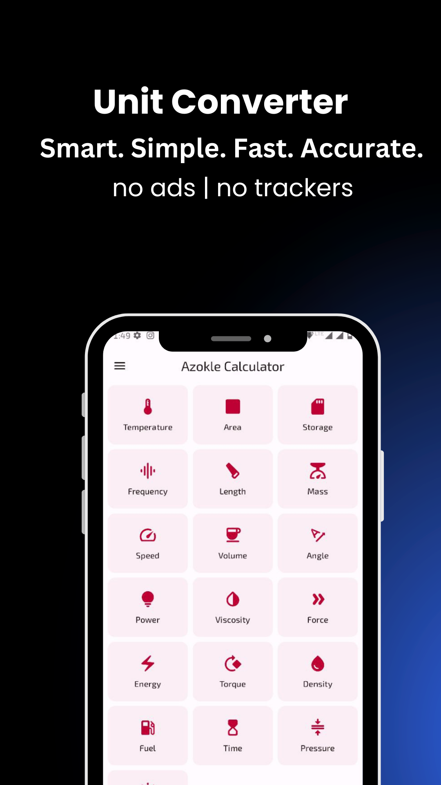
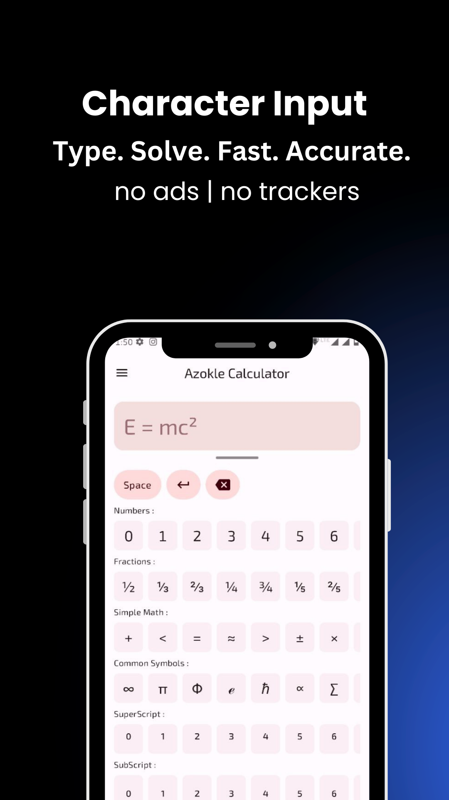
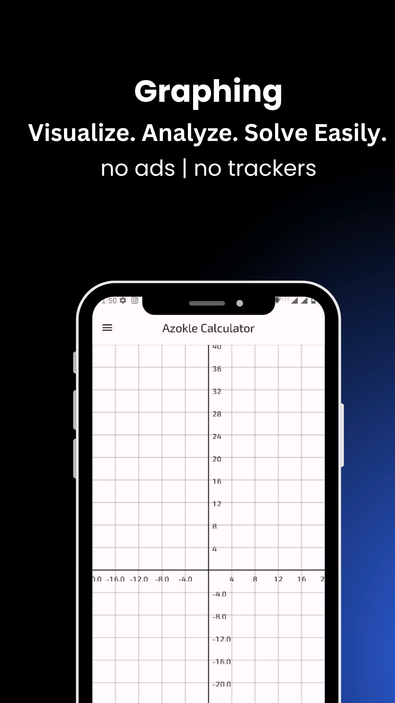

<!-- ---------- Header ---------- -->

  
  <h1>Azokle Calculator</h1>

<strong>Privacy-First Technology</strong> | Innovate. Integrate. Inspire.

A powerful, privacy-focused calculator app built with Material Design 3 (MD3) by <a href="https://azokle.com">Azokle Private Limited</a>.

<!-- ---------- Badges ---------- -->
  

    
    
    
    
    
     

<!-- ---------- Description ---------- -->

---

  
  Screenshots

  
  
  

  
  

## Features

### 1. Powerful Calculator:

- **Basic Calculator**: Perform all your essential calculations with a simple and intuitive interface.
- **Scientific Calculator**: Unleash the power of advanced functions like trigonometry, logarithms, and more.

### 2. Versatile Unit Converter:

- Convert between a wide range of units across various categories like length, weight, volume, currency, and more.

### 3. Character Input Tool:

- Access a vast library of mathematical symbols, including Greek letters, arrows, superscript, subscript, and much more.
- Effortlessly write complex expressions and equations with just a few taps.

### Azokle Calculator also boasts several features that enhance your experience:

- Elegant and user-friendly interface: Switch between basic and scientific mode with a swipe.
- History function: Easily access your past calculations for quick reference.
- Material You theme: Uses a dynamic theme that suits your style and mood.

<!-- ---------- Contribution ---------- -->

## Feedback and contributions

***All contributions are very welcome!***

* Feel free to join the [Matrix room](https://matrix.to/#/#azoklesoftware:matrix.org) for discussions about the app.
* Bug reports and feature requests can be submitted [here](https://github.com/azoklesoftware/azokle-calculator-android/issues) (please make sure to fill out all the requested information properly!).
* If you are a developer and wish to contribute to the app, please read our [CONTRIBUTING.md](CONTRIBUTING.md) and submit a [**pull request**](https://help.github.com/articles/about-pull-requests/).
* For security issues, refer to our [SECURITY.md](SECURITY.md).

## Translation

## Credits
* Icon design by [M00NJ](https://github.com/M00NJ)
* Originally forked from [you-apps/CalcYou](https://github.com/you-apps/CalcYou) (Please see our [NOTICE](NOTICE) file).

## License

Azokle Calculator is licensed under the [**GNU General Public License**](https://www.gnu.org/licenses/gpl.html): You can use, study and share it as you want.
